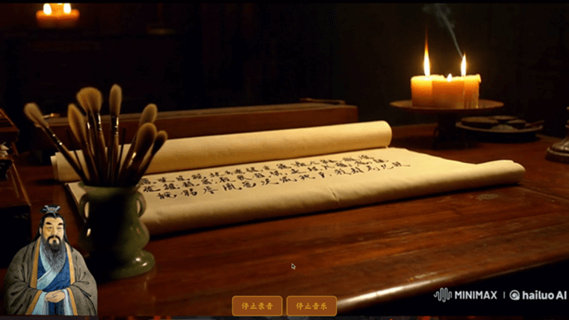

# chat_with_kongzi

**chat_with_kongzi** 是一个结合现代人工智能技术与儒家文化的多模态互动平台。本项目旨在通过技术复现孔子的形象，并利用先进的人工智能技术，帮助用户更生动、更深入地理解儒家思想。本项目集成了 **Live2D** 动态人物形象、**大语言模型**、语音识别与合成、以及文生视频等前沿技术，为用户提供沉浸式的文化学习体验。

## 项目概述

本项目以孔子为核心，融合了多种人工智能技术，打造了一个集 **虚拟人物**、**语音交互**、以及 **历史场景重现** 于一体的儒家文化学习平台。用户可以通过与虚拟孔子互动，学习儒家经典、聆听孔子的智慧解答，并体验历史场景的再现，从而增强对儒家思想的理解和学习兴趣。

### 核心功能

1.  **孔子 Live2D 形象**
    *   通过 **Live2D** 技术，生动展现孔子的动态形象，包括表情变化、头部转动等。
    *   基于 [EasyAIVtuber](https://github.com/Ksuriuri/EasyAIVtuber) 修改，无需 OBS Studio，直接在电脑呈现。

2.  **AI 大语言模型与知识库**
    *   采用 **qwen2.5** 大语言模型，并使用dify构建了基于儒家经典文献的知识库。
    *   模型能从孔子的视角出发，准确回答问题，提供深刻且符合历史背景的答案。
    *   **示例：**
        *   **用户问题**：孔子为何提出“仁”作为核心思想？
        *   **模型回答**：孔子提出“仁”作为核心思想，是因为他认为“仁”是个人修养和社会和谐的基础……

3.  **语音交互**
    *   集成 **Whisper** 语音识别模型，支持用户语音输入。
    *   通过 **[biluo/KongZi](https://huggingface.co/biluo/KongZi/tree/main)** 语音合成模型，将孔子回答转化为语音输出。

4.  **历史场景重现（文生视频）**
    *   采用 **文生视频（Text-to-Video）** 技术，根据用户提问播放相关历史场景视频。

5.  **PyQt 前端界面**
    *   使用 **PyQt5** 构建简洁界面，支持文本和语音输入。
    *   采用多线程，确保界面流畅。



## 环境依赖

### 后端依赖

*   **大语言模型后端**: `ollama` 0.4.2
    *   **模型**: `qwen2.5:32b`
*   **知识库后端**: `dify` 0.8.2
*   **语音识别**: `whisper-large-v3`
*   **TTS 模型**: `GPT-SoVITS V2`
*   **文生视频生成**: `xinference` v0.15.0
    *   **嵌入模型**: `bge-large-zh-v1.5`
    *   **rerank 模型**: `bge-reranker-large`
*   **FastAPI**: `0.115.5`

### 前端依赖

*   Python 3.10 及以上
*   **孔子 Live2D 运行依赖**:
    *   `torch>=2.3.1`
    *   `torchvision>=0.18.1`
    *   `torchaudio>=2.3.1`
*   **前端依赖**:
    *   `PyQt5`
    *   `matplotlib`
    *   `librosa`
    *   `pygame`
    *   `flask_restful`
    *   `protobuf`
    *   `pynput`
    *   `mediapipe`
    *   `opencv_python`
    *   `Pillow`
    *   `pyanime4k`
    *   `pyvirtualcam`
    *   `gradio`
    *   `pyaudio`
    *   `numpy`
    *   `requests`

## 安装与运行

### 1. 安装依赖

```bash
pip install -r requirements.txt
```

### 2. 启动后端

```bash
python fastapi.py
```

### 3. 启动前端

```bash
python kongzi.py
```

或直接运行 `app.exe`。

## 贡献

欢迎通过 GitHub Issues 和 Pull Requests 贡献代码。

## 项目背景与技术实现

本项目旨在通过多模态 AI 技术复现孔子形象，让用户沉浸式学习儒家文化。核心技术包括：

*   **Live2D 动态形象**: 基于 [ EasyAIVtuber ](https://github.com/Ksuriuri/EasyAIVtuber)，无需外部工具，直接在电脑呈现。
*   **AI 大语言模型**: 使用 `qwen2.5` 并构建了儒家知识的知识库。
*   **语音交互**: `Whisper` 用于语音识别，`GPT-SoVITS2` 用于语音合成。
*   **文生视频**: 根据问题播放相关历史场景视频，增强沉浸感。
*   **PyQt 前端**: 使用多线程，保证用户界面流畅。

此项目使用了`Midjourney`文生图生成孔子形象，以及海螺和可灵平台生成文生视频，并使用`sunoAI`生成了背景音乐。
